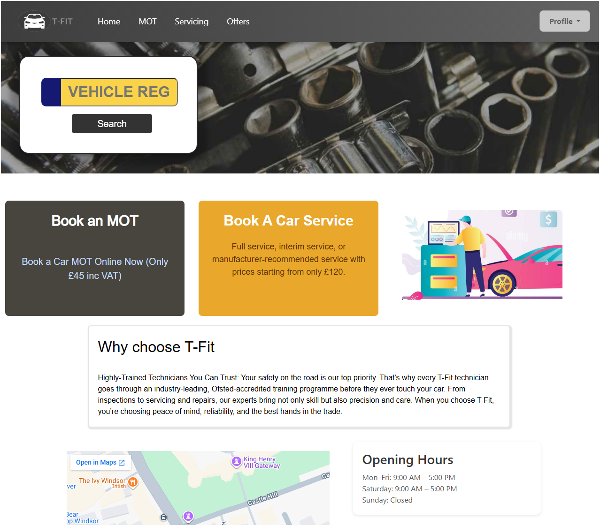

## MOT & Vehicle Service Booking App (Django)

### Project Overview

This is a Django-based booking system for vehicle MOT and vehicle servicing. Customers can book appointments for MOTs or services, select available 1-hour time slots, and view their bookings in the dashboard. Employees can view all bookings and update booking statuses.

## Preview



Note: This project does not connect to any official government vehicle registration database. All vehicle information is stored manually in the local project database for demonstration and testing purposes.

Demo vehicle registration numbers:

- `HH24BBB`
- `SS16DDD`
- `GG18NNN`
- `KK25TST`
- `TE10STT`

Note: The demo data above is available when using Docker Compose with the included database backup.

## Features

1. User authentication for customers and employees
2. Vehicle lookup by registration number
3. Booking flow for MOT and vehicle servicing
4. Employee dashboard for viewing, searching, and updating bookings

## Usage

### Customer Dashboard

Customers can sign up, log in, create bookings, and view their dashboard.

### Employee Dashboard

Access the employee dashboard at `http://127.0.0.1:8000/employee/dashboard/`.

Note: The credentials below are demonstration-only local development credentials for this sample project. Do not reuse them for real accounts, production systems, or public deployments.

Login credentials:

- Email: `staff@example.com`
- Password: `staffstaff`

## Tech Stack

- Django
- PostgreSQL
- Docker Compose
- HTML, CSS, JavaScript
- Jazzmin admin theme

## Installation

### Local Setup

If you run the project locally without restoring `local_backup.sql`, the app starts with a clean database. In that case, you will need to create your own superuser and populate the required data through the admin panel.

From the repository root:

```bash
cd app
python -m venv venv
. venv/Scripts/activate
pip install -r requirements.txt
python manage.py migrate
python manage.py createsuperuser
python manage.py runserver
```

Open `http://127.0.0.1:8000/`.

### Docker Compose Setup

Docker Compose starts the Django app, PostgreSQL, and pgAdmin using values from the root [`.env`](/c:/Users/BO/Desktop/NucampFolder/Python/3-DevOps/carservice/.env) file. It also restores the included `local_backup.sql` database so the app is ready with demonstration data.

Start the containers from the repository root:

```bash
docker compose up -d --build
```

Open:

- App: `http://127.0.0.1:8000/`
- Admin: `http://127.0.0.1:8000/admin/`
- pgAdmin: `http://127.0.0.1:5433/`

Admin credentials for the seeded Docker data:

Note: These are demonstration-only local Docker credentials. Replace them before any shared, remote, or production-style deployment.

- Username: `admin@example.com`
- Password: `admin`

If you change database or app settings, update [`.env`](/c:/Users/BO/Desktop/NucampFolder/Python/3-DevOps/carservice/.env) instead of editing `settings.py` directly.

## License

This project is licensed under the MIT License.
